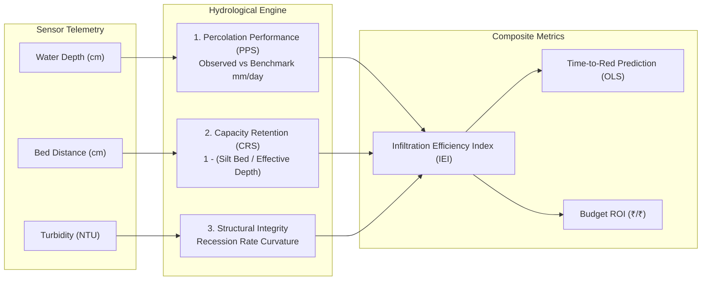

<div align="center">

# 🌿 THULIR (துளிர்)
### *IoT & AI-Driven Groundwater Recharge Monitoring & Predictive Restoration Platform*

[](https://reactjs.org/)
[](https://www.typescriptlang.org/)
[](https://nodejs.org/)
[](https://vitejs.dev/)
[](https://tailwindcss.com/)
[](https://web.dev/progressive-web-apps/)
[](LICENSE)

<p align="center">
  <b>Pasumai Hackathon & Startup Summit 2.0</b> • <i>SRM Institute of Science and Technology</i>
</p>

[Key Features](#-key-features) • [Hydrological Model](#-hydrological-modeling--iei-formula) • [System Architecture](#-system-architecture) • [Audience-Adaptive UX](#-audience-adaptive-ux) • [Offline Dispatch](#-offline-resilience--emergency-field-dispatch) • [Getting Started](#-getting-started) • [API Reference](#-api-specification)

---

</div>

## 📌 Executive Summary

Over **65% of India’s rural water harvesting structures** (check dams, percolation ponds, recharge shafts) suffer from silent failure due to severe siltation and unmonitored bed clogging. When monsoon rains arrive, these compromised structures fail to infiltrate runoff, causing precious rainwater to evaporate or wash away while groundwater tables continue to plummet.

**THULIR (துளிர்)** bridges the critical gap between raw IoT edge sensing and grassroots civil action. It delivers real-time siltation tracking, multi-criteria infiltration health index computation, predictive time-to-failure forecasting, and budget-optimized restoration prioritization — accessible online or 100% offline in remote agrarian catchments.

---

## 🚀 Key Features

| Capability | Description |
| :--- | :--- |
| 🧮 **Infiltration Efficiency Index (IEI)** | Transparent multi-criteria score ($0.0 - 1.0$) combining percolation rate, capacity loss, and structural integrity. |
| ⏳ **Predictive Time-to-Failure** | Ordinary Least Squares (OLS) regression calculating exact days until warning structures hit critical failure. |
| 🌾 **Hydro-Economic Impact Framing** | Converts technical silt metrics into visceral economic outcomes: lost recharge volume ($m^3$), agricultural crop deficit ($\text{Acres}$), and financial loss ($\text{₹}$). |
| 💰 **Budget ROI Optimization** | Dynamic work-order ranking maximizing **Capital Recharge Efficiency** ($\text{₹ Saved} / \text{₹ Desilt Cost}$) for limited panchayat budgets. |
| 👥 **Audience-Adaptive UX** | Single-click toggle between **Simple View** (Panchayat Presidents / VAOs) and **Detailed View** (WRD Engineers / Hydrologists). |
| 📲 **1-Click Field Dispatch** | Zero-latency emergency ticket generation dispatched directly via **WhatsApp** and **Cellular SMS (`sms:`)** with zero gateway fees. |
| ⚡ **PWA Offline Resilience** | Service Worker runtime caching enabling uninterrupted field diagnostics in remote connectivity dead zones. |

---

## 🔬 Hydrological Modeling & IEI Formula

THULIR rejects black-box AI by implementing a transparent, verifiable hydrological formula derived from empirical groundwater recharge dynamics:

$$\mathbf{IEI} = 0.45 \times \text{PPS} + 0.40 \times \text{CRS} + 0.15 \times \text{Integrity}$$



### 1. Percolation Performance Score (PPS)
$$\text{PPS} = \min\left(1.0, \, \frac{\text{Observed Infiltration Rate } (\text{mm/day})}{\text{Benchmark Percolation Rate } (\text{mm/day})}\right)$$

### 2. Capacity Retention Score (CRS)
$$\text{CRS} = 1.0 - \left(\frac{\text{Current Silt Depth } (\text{cm})}{\text{Original Effective Depth } (\text{cm})}\right)$$

### 3. Structural Integrity Score
Evaluates the hydrograph recession curve against abnormal draining patterns indicative of masonry breach or structural bypass.

---

## 🏗 System Architecture

```
thulir/
├── server/                         # Express & TypeScript Hydrological Backend
│   ├── src/
│   │   ├── ieiEngine.ts            # Mathematical IEI, OLS Regression & ROI Engine
│   │   ├── inMemoryStore.ts        # Resilient Zero-Credential Fallback Store
│   │   ├── mockGenerator.ts        # Synthetic Telemetry & Historical Reset Generator
│   │   ├── routes.ts               # REST API Endpoints
│   │   ├── types.ts                # Shared TypeScript Interfaces
│   │   └── index.ts                # Server Entry Point (Port 4000)
│   └── tsconfig.json
│
└── src/                            # React 18 + Vite + PWA Dashboard
    ├── api/
    │   ├── client.ts               # Typed HTTP Client with LocalStorage Cache
    │   └── types.ts                # Frontend Data Models
    ├── components/
    │   └── dashboard/
    │       ├── CatchmentMap.tsx        # Esri Dark Gray GIS Spatial Map
    │       ├── ScoreBreakdown.tsx      # Formula Explainability Popover
    │       ├── SummaryBar.tsx          # Catchment Hydro-Economic KPIs
    │       ├── TrendChart.tsx          # Chart.js Percolation Timeseries
    │       ├── DesiltingImpact.tsx     # Before vs After Restoration Analytics
    │       ├── WorkOrderList.tsx       # Dual-Sort Maintenance Queue (Urgency / ROI)
    │       └── OfflineDispatchModal.tsx # WhatsApp & Cellular SMS Direct Dispatch
    ├── pages/
    │   └── Dashboard.tsx           # Adaptive UX Density Page Controller
    ├── index.css                   # Cyber-Ecological Design System
    ├── vite.config.ts              # Vite + Workbox PWA Configuration
    └── main.tsx                    # React Root Entry Point
```

---

## 👥 Audience-Adaptive UX

THULIR serves two completely different stakeholders from a single source of truth without duplicating software infrastructure:

```
[ VIEW: SIMPLE ]                                   [ VIEW: DETAILED ]
├── Panchayat Presidents & VAOs                    ├── WRD Hydrologists & GIS Engineers
├── Plain-language status words                    ├── Exact decimal IEI & Sub-scores (PPS/CRS)
├── 1-sentence non-technical instructions          ├── Timeseries rate curves & recession slopes
├── Single-click WhatsApp/SMS emergency dispatch   ├── OLS days-to-red trend forecasting
└── High-contrast spatial map                      └── Capital recharge ROI sort mode (₹/₹)
```

---

## 📲 Offline Resilience & Emergency Field Dispatch

In rural agrarian catchments where extreme weather knocks out 4G cellular data:
1. **Progressive Web App (PWA):** Workbox runtime caching (`NetworkFirst` with cached offline fallback) guarantees uninterrupted dashboard rendering.
2. **Instant WhatsApp 1-Click Dispatch:** Directly triggers `api.whatsapp.com/send` to open the recipient's chat with the pre-drafted bilingual work order loaded with **zero confirmation prompts**.
3. **100% Free Cellular SMS Protocol (`sms:`):** Native device intent generates formatted dispatch tickets transmitting GPS coordinates, silt depth, and required actions over 2G GSM with **zero gateway fees or API subscriptions**.

```
[THULIR OFFLINE ALERT - URGENT]
Structure: Sitheri Check Dam (Check Dam)
GPS: 12.2450, 79.0680
Status: RED | IEI: 0.32
Silt Bed: 48 cm (62% capacity lost)
Lost Recharge: 14,200 m³ per monsoon
Action: Desilting recommended immediately before monsoon runoff.
Sent via THULIR Offline Field Dispatch
```

---

## 🚦 Getting Started

### Prerequisites
- **Node.js**: v18.0.0 or higher
- **npm**: v9.0.0 or higher

### 1. Clone Repository
```bash
git clone git@github.com:JoseScript7/Thulir.git
cd Thulir
```

### 2. Install Dependencies
```bash
# Install frontend dependencies
npm install

# Install backend dependencies
cd server && npm install && cd ..
```

### 3. Launch Development Environment
```bash
# Concurrently start frontend (Vite: 5173) and backend (Express: 4000)
npm run dev:all
```

- **Frontend Dashboard:** [http://localhost:5173/dashboard](http://localhost:5173/dashboard)
- **Backend API:** [http://localhost:4000](http://localhost:4000)

### 4. Production Build
```bash
# Build frontend with PWA service worker precaching
npm run build

# Build backend TypeScript
cd server && npm run build
```

---

## 📡 API Specification

| Route | Method | Description |
| :--- | :--- | :--- |
| `/structures` | `GET` | Retrieve all monitored recharge structures with computed IEI and sensor quality. |
| `/structures/:id` | `GET` | Fetch granular telemetry time-series and computed diagnostics for a single structure. |
| `/structures/:id/desilting-events` | `GET` | Historical before-and-after desilting restoration impact records. |
| `/workorders` | `GET` | Active maintenance queue with dynamic sorting (`Urgency` vs `Budget ROI`). |
| `/summary` | `GET` | Catchment-wide aggregates (total lost recharge volume, lost crop acres, lost financial value). |
| `/telemetry` | `POST` | Ingest real-time telemetry payloads from edge IoT nodes. |

---

## 🌍 UN Sustainable Development Goals (SDGs)

THULIR directly contributes to the United Nations 2030 Agenda:
- **SDG 6 (Clean Water & Sanitation):** Target 6.6 — Protect and restore water-related ecosystems and aquifers.
- **SDG 11 (Sustainable Cities & Communities):** Climate-resilient rural infrastructure management.
- **SDG 13 (Climate Action):** Target 13.1 — Strengthen resilience against severe drought and erratic monsoon floods.

---

## 👥 Contributors & Credits

Developed with ❤️ for **Pasumai Hackathon & Startup Summit 2.0** at **SRM Institute of Science and Technology**.

*Empowering rural communities with actionable water intelligence.*